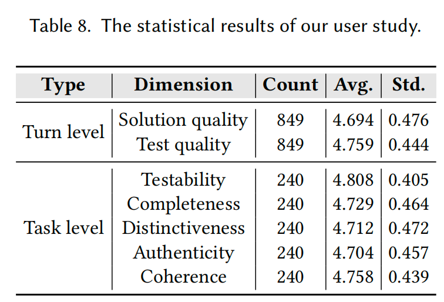

# ICE-Bench

## About

ICE-Bench is a benchmark specifically designed to assess LLMs for Iterative Code gEneration under progressive requirement refinement scenarios.

## Setup

Ensure that [uv](https://github.com/astral-sh/uv/releases/tag/0.8.11) is installed. Then run the following command to set up the environment.

```bash
# Install dependency
uv sync
# Activate the virtual environment
source .venv/bin/activate
```

Set up api key in `.env` file: 
```bash
mv .env.example .env
```

API Format
```bash
{API_PROVIDER}_API_KEY=...
{API_PROVIDER}_BASE_URL=...
```

Set up sandbox and repository environment: see `environment` directory.

## Dataset

All datasets are saved in the `./dataset` directory, and the directory structure is as follows:
```
├── java_function.jsonl
├── java_repository.jsonl
├── python_function.jsonl
└── python_repository.jsonl
```

The unified data format is:
```py
@dataclass
class MultiTurnDataInstance:
    hash_id: str    # As the unique identifier of data
    total_turn: int
    turn_datas: List[PerTurnDataInstance] # Each sample corresponds to data from multiple rounds.
    metadata: Dict[str,Any] # Store the information of the original dataset
    mt_id: Optional[int] = field(default=None)     # Used as the primary key of the database, it has no impact on the evaluation

@dataclass
class PerTurnDataInstance:  # A minimal evaluation unit
    turn_num: int
    instruction: str
    solution: Optional[str] = field(default=None)
    test: Optional[str] = field(default=None)
```

## Inference

Please configure the parameters in `./script/run_inference.sh`, and then directly run this inference script:
```bash
bash script/run_inference.sh
```

Currently, the Python repository level still needs to rely on the original repository. Please go to `environment/python_repo`.

## Evaluation

For the function level, we support concurrent evaluation. Please use the following code and replace the parameters with those you need:

```python
from data_construction.data import data_manager
from dotenv import load_dotenv
from evaluation.eval import MTEvaluation
import asyncio

load_dotenv()
eval_module = MTEvaluation(
    llm_provider="",
    llm="",
    context_setting="", # base, golden
    prompt_setting="fh", # fh, edit, ci
    think_flag="qwen3-think", # For gpt-oss series with thinking mode, use `oss-think`, for qwen3 series with thinking mode, use `qwen3-think`
    lang="python", # python, java, java-repo
    run_id="default", # Just keep it unchanged; it is used for the output file name.
    max_workers=5,
    command="evaluation"
)
asyncio.run(eval_module.run_evaluation())
```

For repository-level Java tasks, if you want to use concurrency, please prepare multiple Docker containers by yourself. This is because there is a risk in concurrent file replacement operations. To reduce the slow speed caused by downloading mvn dependencies during the first visit, you can use the file in `data_construction/data/seed/mrgbench/docker_warmup.py` to warm up the docker before the evaluation.

After the environment is configured, you can run it using the following code:
```py
from data_construction.data import data_manager
from dotenv import load_dotenv
from evaluation.eval import MTEvaluation
llm_providers = ["deepinfra","deepinfra","deepinfra"]
llms = ["Qwen/Qwen3-Coder-480B-A35B-Instruct","openai/gpt-oss-20b","openai/gpt-oss-20b"]
think_flags = ["None","oss-think","None"]
for llm_provider, llm, think_flag in zip(llm_providers,llms, think_flags):
    for ct in ['base','golden']:
        for ps in ['fh','edit','ci']:
            if ct == 'golden' and ps == 'ci':
                continue
            eval_module = MTEvaluation(
                llm_provider=llm_provider,
                llm=llm,
                context_setting=ct,
                prompt_setting=ps,
                think_flag=think_flag,
                lang="java-repo",
                run_id="default",
                max_workers=1,
                command="evaluation"
            )
            eval_module.run_evaluation_for_repo()
```

Currently, the Python repository level still needs to rely on the original repository. Please go to `environment/python_repo`.

## Data Construction

Run multi-agent based requirement generation:
```bash
# python function level
PYTHONPATH=. python -m data_construction.pipeline --decomposition --dataset bigcodebench
# java function level
PYTHONPATH=. python -m data_construction.pipeline --decomposition --dataset autocodebench
# java repository level
PYTHONPATH=. python -m data_construction.pipeline --decomposition --dataset mrgbench
```

Run semantic-aware discriminative test case generation:
```bash
# python function level
PYTHONPATH=. python -m data_construction.pipeline --codegen --dataset bigcodebench --max_iter_number 10
# java function level
PYTHONPATH=. python -m data_construction.pipeline --codegen --dataset autocodebench --max_iter_number 10
# java repository level
PYTHONPATH=. python -m data_construction.pipeline --codegen --dataset mrgbench --max_iter_number 10
```

Other params:
- `--auto_skip`: skip human-in-the-loop
- `--init_ablation_study_db`: option for rq3, should run it first.
- `--skip_evaluator`: option for rq3
- `--skip_evaluator_and_distinctiveness`: option for rq3

## User Study

To further investigate how well our multi-turn requirements capture the evolving nature of software specifications in real-world iterative development, we conducted a user study. 

The annotion guideline is in `user_study/annotation_guidelines.md` and the results are as follow:




## 🙏 Acknowledgement

- [BigcodeBench](https://github.com/bigcode-project/bigcodebench)
- [DevEval](https://github.com/seketeam/DevEval?tab=readme-ov-file)
- [AutoCodeBench](https://github.com/Tencent-Hunyuan/AutoCodeBenchmark/tree/main)
- [MRGBench](https://github.com/MRG-Bench/MRG-Bench/)